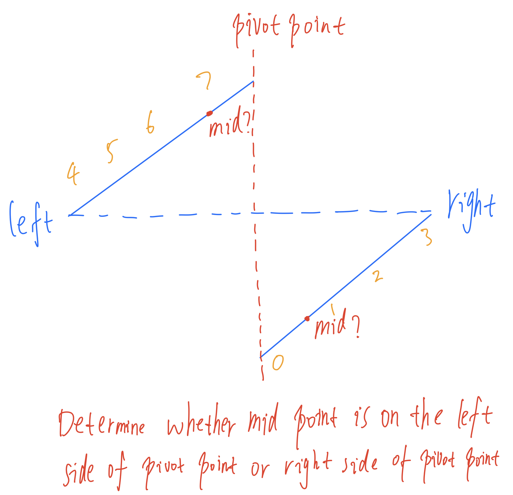

# Search in Rotated Sorted Array

## Problem

There is an integer array ```nums``` sorted in ascending order (with **distinct** values).

Prior to being passed to your function, ```nums``` is **possibly rotated** at an unknown pivot index ```k (1 <= k < nums.length)``` such that the resulting array is ```[nums[k], nums[k+1], ..., nums[n-1], nums[0], nums[1], ..., nums[k-1]]``` (**0-indexed**). For example, ```[0,1,2,4,5,6,7]``` might be rotated at pivot index ```3``` and become ```[4,5,6,7,0,1,2]```.

Given the array ```nums``` **after** the possible rotation and an integer ```target```, return the *index* of ```target``` *if it is in ```nums```, or ```-1``` if it is not in ```nums```*.

You must write an algorithm with O(log n) runtime complexity.

## Example

```java
Input: nums = [4,5,6,7,0,1,2], target = 0
Output: 4
```

## Solution



We can see that at the point of rotation, we can easily divde the arrays into two halves, where there is at least one half (left or right) that is monotonically increasing.

- If the entire left part is monotonically increasing, which means the pivot point is on the right part
  - If left <= target < mid ------> drop the right half
  - Else ------> drop the left half

- If the entire right part is monotonically increasing, which means the pivot point is on the left part
  - If mid < target <= right ------> drop the left half
  - Else ------> drop the right half

```java
    public int search(int[] nums, int target) {
        int low = 0;
        int high = nums.length - 1;

        while (low <= high) {
            int mid = low + (high - low) / 2;

            if (nums[mid] == target) {
                return mid;
            } else if (nums[mid] >= nums[low]) {
                if (target >= nums[low] && target < nums[mid]) {
                    high = mid - 1;
                } else {
                    low = mid + 1;
                }
            } else {
                if (target <= nums[high] && target > nums[mid]) {
                    low = mid + 1;
                } else {
                    high = mid - 1;
                }
            }
        }

        return -1;
    }
```

## Complexity

Time: O(log n) </br>
Space: O(1)
